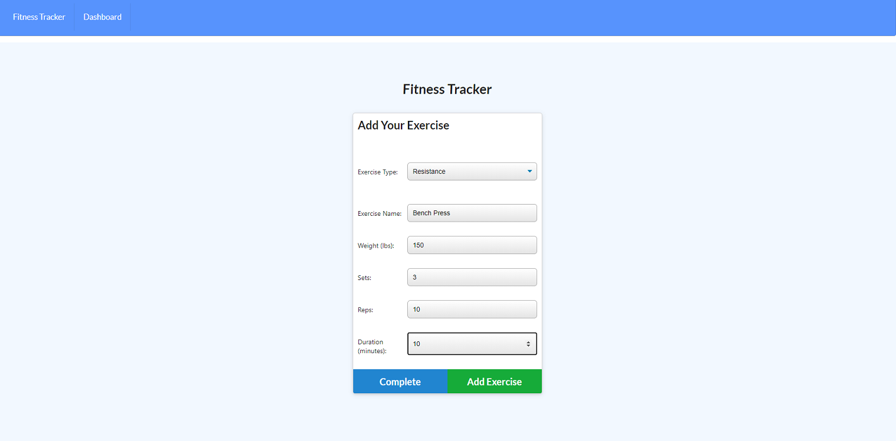

# Workout Tracker

## Description
Keep track of your workouts with this Fitness Tracker. Users can view and create daily workouts by adding an exercise name, type of exercise, weight, sets, reps and exercise duration.  With a cardio exercise, users can also keep track of their distance traveled.

## Usage
Clone the repo and in the [CLI](https://www.w3schools.com/whatis/whatis_cli.asp), navigate to the root folder and type `npm install` to install all the dependencies for this project. You will need a Mongo database connection set up to save the workout data. To start the server, type `npm start server`. To run the seed file, type `npm run seed`. 

## Technologies
* [Express](https://www.npmjs.com/package/express)
* [Mongoose](https://www.npmjs.com/package/mongoose)
* [Dotenv](https://www.npmjs.com/package/dotenv)

## Screenshot

## URL
[GitHub](https://github.com/crrmarchese/workout-tracker)

[Heroku](https://workout-tracker-cm.herokuapp.com/)